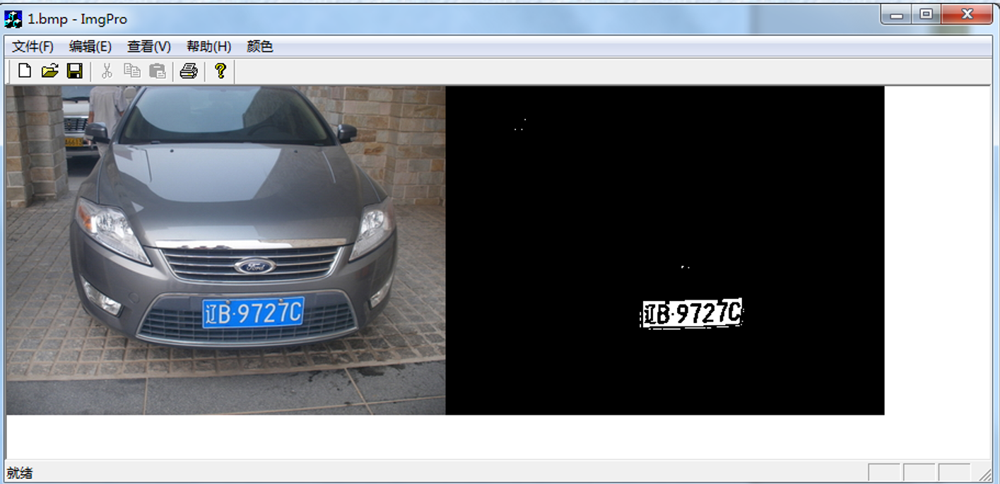
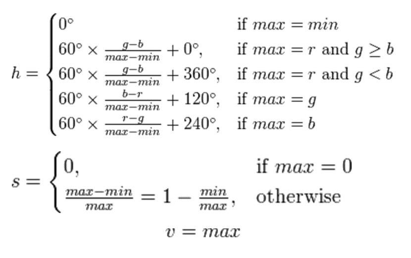
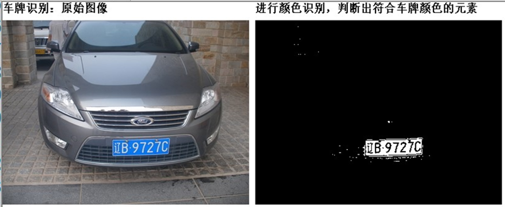
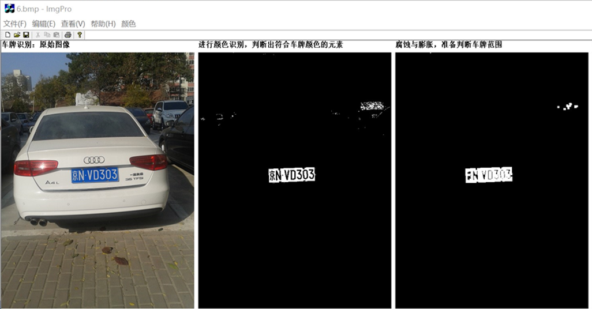
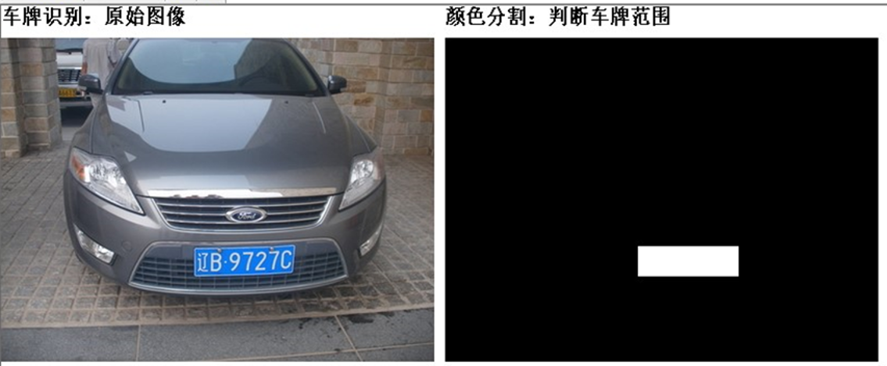
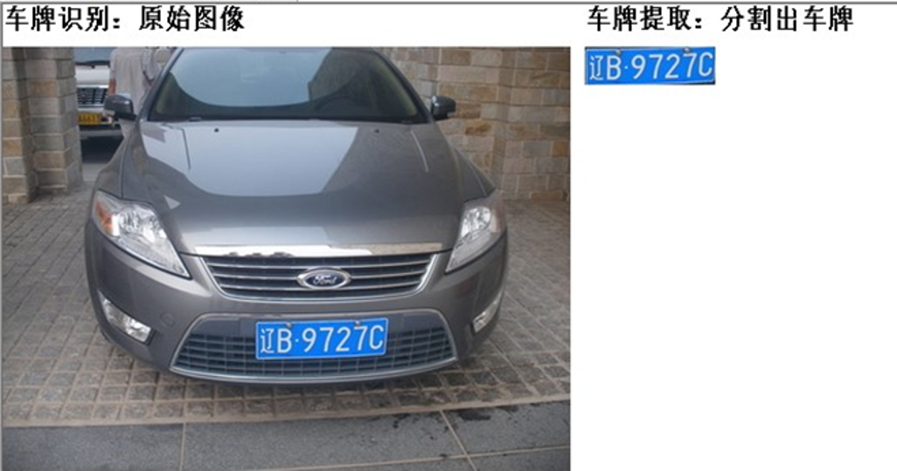
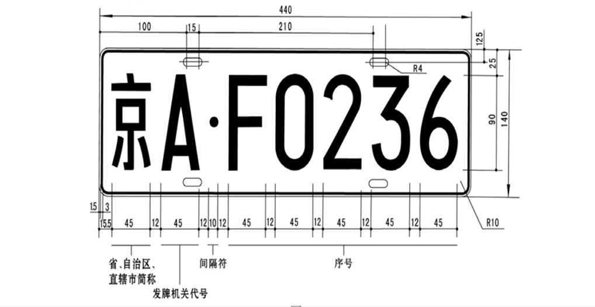
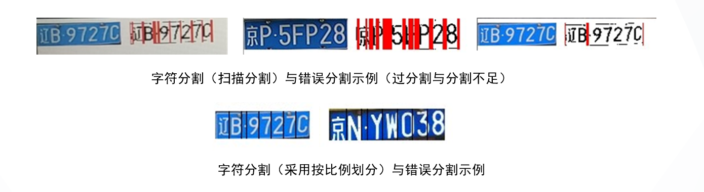

# License-plate-detection

数字图像处理课程的大作业，要求我们根据自然情境下的车牌图片，定位出其中的车牌部分并且将车牌字符分割出来。本次作业中采用了基于颜色空间的图像分割办法， 将车牌的图片 在 HSV 空间下判断 出符合车牌颜色范围的元素，利用形态学处理的腐蚀膨胀 去除小的噪声污染，根据连通域检 测去除大的其他物体干扰，定位车牌后将其保存，根据新的图像的灰度化二值化，判断字符 和背景的区别，最后在背景上分割出车牌图像。

## 一、作业背景

车牌是车辆的唯一标识，具有特殊性和重要性。因此，车牌自动识别是智能交通管理系统中的关键部分。此外，基于图像的车牌识别方法具有非接触式、不需要在车辆上额外安装附加设备等特点，拥有更加广泛的应用前景。车牌识别在高速公路车辆管理中得到广泛应用，电子收费（ETC）系统中，也是结合DSRC技术识别车辆身份的主要手段。在停车场管理中，车牌识别技术也是识别车辆身份的主要手段。在深圳市公安局建设的《停车库（场）车辆图像和号牌信息采集与传输系统技术要求》中，车牌识别技术成为车辆身份识别的主要手段。我们在课堂上的目标就是，将自然场景下的含车牌图片，识别出其中的车牌区域，并将字符分割出来。由于重点是数字图像处理的算法，老师已经给出了我们基本程序框架，我们可以从img[]数组中读出每一个像素点对应的rgb信息，以8位值量化。


## 二、车牌检测的方法

目前车牌定位的方法很多，但总的来说可以分为以下几种

1. 基于颜色的分割方法，这种方法主要利用颜色彩色边缘算法、颜色距离和相似度算法等；
2. 基于纹理的分割方法，这种方法主要利用车牌区域水平方向的纹理特征进行分割，包括小波纹理、水平梯度差分纹理等；
3. 基于边缘检测的分割方法；基于边缘检测的分割方法；
4. 基于数学形态法的分割方法。基于数学形态法的分割方法。

在此次作业中，我们使用了基于颜色的分割方法。在此次作业中，我们使用了基于颜色的分割方法。本文着重于研究小型车辆的蓝色车牌，本文着重于研究小型车辆的蓝色车牌，由于蓝色车牌颜色的特殊性，考虑采用人眼视觉更加接近的由于蓝色车牌颜色的特殊性，考虑采用人眼视觉更加接近的HSVHSV色彩色彩空间，对目标区域进空间，对目标区域进行筛选和提取，对提取得到的区域进行进一步的形态学处理，消除其他与车牌颜色相近物体行筛选和提取，对提取得到的区域进行进一步的形态学处理，消除其他与车牌颜色相近物体的误差并选定车牌区域，最后在选定的车牌区域根据字体和背景颜色的不同，在其灰度图像的误差并选定车牌区域，最后在选定的车牌区域根据字体和背景颜色的不同，在其灰度图像中二值化，根据连通域分析分割出字符和字符（中间一直是背景无字符则分开）。中二值化，根据连通域分析分割出字符和字符（中间一直是背景无字符则分开）。

## 三、具体实现细节

### 3.1 预处理 将 RGB 色彩空间转换到 HSV 色彩空间

HSV（也叫 HSB ）是对 RGB 色彩空间中点的一种有关系的表示，它尝试描述比RGB更准确的感知颜色 联系，并仍保持在计算上简单。 H指 hue （色相）、 S指 saturation （饱和度）、V指 value(色调）。色相（H）是色彩的基本属性，就是平常所说的颜色名称，如红色、黄色等。饱和度（S）是指色彩的纯度，越高色彩越纯，低则逐渐变灰，取0 100%的数值。明度（V），亮度B），取 0 100% 。HSV模型通常用于计算机图形应用中。在用户必须选择一个颜色应用于特定图形元素各种应用环境中，经常使用 HSV 色轮。在其中，色相表示为圆环；可以使用一个独立的三角形来表示饱和度和明度。典型的，这个三角形的垂直 轴指示饱和度，而水平轴表示明度。在这种方式下，选择颜色可以首先在圆环中选择色相，在从三角形中选择想要的饱和度和明度。


```C++
void CImgProView::Color()
{
    BYTE r,g,b;
    int i,j;
    double hg,hr;
    double max1=0.0;
    BYTE gray;
    gray = 0;
    flag = 1;
    OnInitialUpdate();

    huiimg = new BYTE[width * height];
    huiimg1 = new BYTE[width * height];
    huiimg2 = new BYTE[width * height];
    huiimg3 = new BYTE[width * height];
    BYTE max, min, delta;
    double h, s, v;
    for (int i = 0; i < height; i++)
    {
        for (int j = 0; j < width; j++)
        {
        b = rgbimg[i * 3 * width + j * 3];
        g = rgbimg[i * 3 * width + j * 3 + 1];
        r = rgbimg[i * 3 * width + j * 3 + 2];
        max = (r > g) ? r : g;
        max = (max > b) ? max : b;
        min = (r < g) ? r : g;
        min = (min < b) ? min : b;
        delta = max - min;
            if (delta == 0)
                h = 0;
            else
            {
                if (max == r && g >= b)
                h = double(60 * (g - b)) / delta;
                if (max == r && g < b)
                h = double(60 * (g - b)) / delta + 360;
                if (max == g)
                h = double(60 * (b - r)) / delta + 120;
                if (max == b)
                h = double(60 * (r - g)) / delta + 240;
            }
        }
    }
}
```

### 3.2 在HSV色彩空间内对车牌进行初步定位

在HSV色彩空间内，蓝色和其临近色的饱和度H处以一个有限的范围内，事实上，我们知道以下颜色的饱和度，而它们均为蓝色的临近颜色：
> 青色：180，青蓝：210，蓝色：240，紫蓝色：270 

因此，归一化以后，H的取值范围在<b>0.5~0.75</b>而查看色表可以知道，要使人眼对相应的颜色产生感觉，则<b>S>=0.25，V>=0.125</b>所以我们就可以得到一个初步的筛选模式，利用HSV的范围进行初步筛选。


我们得到的是一个二值化图像，是因为我们对符合值要求的内容和不符合的进行了二值化，具体代码如下：

```C++
//输出的huiimg1[]是车牌区域图像的二值化图像，车牌区域白色，其他黑色
//******************************************
v = max;
if (v == 0)
{
    s = 0;
}
else
    s = double(delta) / max;
if (h < 0)
    h += 360;
if ((h <= 270.0 && 208.0 <= h) && s > 0.52)
{
    huiimg1[i * width + j] = 255;
}
else
{
    huiimg1[i * width + j] = 0;
}
```

我们现在要做的，就是利用现在这个二值图像，将车牌区域、字符位置定位出来，两者思路相似，都是利用颜色与连通域分析，所以重点只做了车牌区域的定位，字符定位只是简单的根据位置划分了一下。

由于图片中会出现其他颜色的干扰，我们要做的就是利用数字图像处理的算法，将这些干扰消除，并成功定位到车牌位置。

### 3.3 形态学处理——腐蚀与膨胀

对于噪声点来说，如果是小块噪声，经过腐蚀与膨胀可以对其进行消除。

```C++
BYTE* tempout;
BYTE* tempout2;
tempout = new BYTE[width * height];
tempout2 = new BYTE[width * height];

erosion(huiimg1, width, height, tempout,1);         //first腐蚀then膨胀
dilation(tempout, width, height, tempout2,2);       //开运算
erosion(tempout2, width, height, tempout, 1);       //膨胀多余腐蚀
dilation(tempout, width, height, huiimg1, 1);       //是为了尽量减少车牌区域的损失
```


从上图我们可以看出，经过腐蚀与膨胀，小块污点确实可以被去除，但是对于稍大点的污点，或者说一群小的污点，腐蚀与膨胀会让他们成为一个大块污点，我们可以就此时图像中的数据进行形状比对，一般来说污点不可能比车牌大，我们只要找到最大的一块连通域（白色区域）就可以。

### 3.4 消除大块误差。

用于消除腐蚀与膨胀无法消去的，如大块天空，入镜的其他车牌造成的误差，由于一般来说它们的横向长度不长，小于待检测车牌，我们检测他们横向像素点的长度，如果在一段图像中检测其一行有像素的长度不足整幅图像的1/10（预估的长度），直接舍弃这一段图像，认为它不是车牌而是干扰图像。

```C++
//腐蚀膨胀中可能对大块污点处理不充分，
//根据污点长度和车牌长度比较将其直接从图像中去除。
//maxh,minh纵向范围，maxw,minw横向范围
//**************************************************************
maxw = height / 10; 
maxh = width / 10; 
minh = 9 * height / 10; 
minw = 9 * width / 10;

for (i = 0; i < height; i++) {
    int c = 0;
    for (j = 0; j < width; j++) {
        if (huiimg1[i * width + j] == 255)
            c = c + 1;                                           
    }
    if (c < width / 20) {
        for (j = 0; j < width; j++) {
            huiimg1[i * width + j] =0;
        }
    }
}                                                          //去除大块污点
```

### 3.5 车牌图像定位

在消除误差点后，我们认为得到的一块区域全部都是车牌的范围，所以我们根据二值化图像白色点首先出现的位置，确定图像的最左、最右、最上、最下坐标，认为在这个矩形范围内的就是车牌，保留号对应的坐标，我们可以识别并分割出车牌。


```C++
for (i = 0; i < height; i++){
    for (j = 0; j < width; j++) {
        if (huiimg1[i * width + j] == 255 && j < minw) {
            minw = j;
        }
        if (huiimg1[i * width + j] == 255 && j > maxw) {
            maxw = j;
        }
    }
}                                                    //find    minw,maxw
for (i = 0; i < height; i++) {
    for (j = 0; j < width; j++) {
        if (huiimg1[i * width + j] == 255 && i < minh) {
            minh = i;
        }
        if (huiimg1[i * width + j] == 255 && i > maxh) {
            maxh = i;
        }
    }
}                                                     //find    minh,maxh
for (i = 0; i < height; i++) {
    //根据找到的车牌范围处理图像
    for (j = 0; j < width; j++) {
        if (i >= minh && i <= maxh && j <= maxw && j >= minw) {
            huiimg1[i * width + j] = 255;
        }
        else {
            huiimg1[i * width + j] = 0;
        }
        huiimg[i * width + j] = huiimg1[i * width + j];
    }
}

```

### 在定位的车牌图像中，同样使用颜色分割，就可以将蓝色的车牌底色与白色的车牌字符分开



另一种方法则是，使用霍夫曼变换矫正图片角度（没做），然后直接根据车牌字符分割划分。这样的划分又可以直接按比例划分，或者按车牌连通域划分（横向扫描）。




